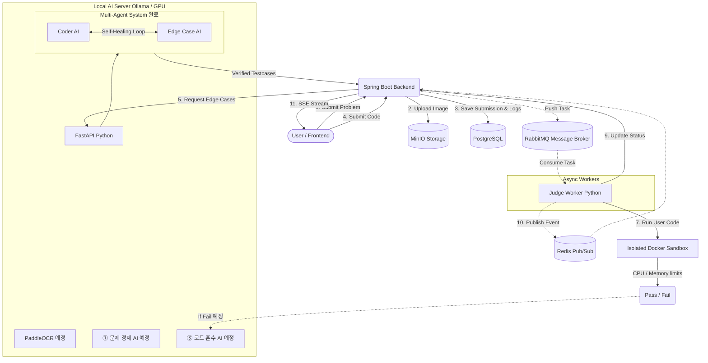
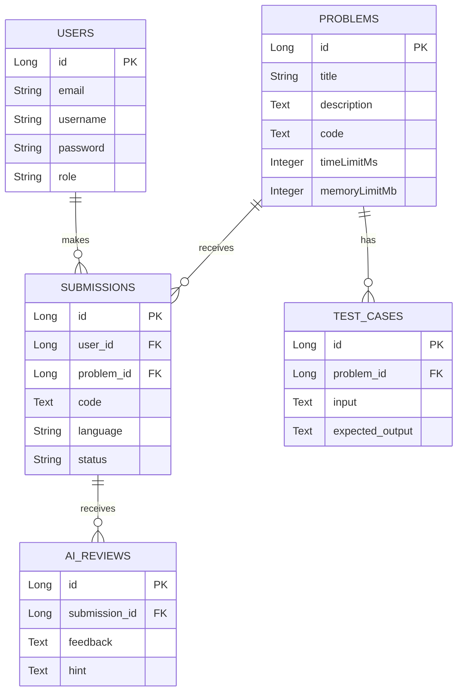

# 🚀 AI 기반 알고리즘 악질 저지(Judge) 및 1:1 코딩 마스터 플랫폼

<div align="center">
  <h3>"Multi-Agent 자가 치유(Self-Healing) 시스템을 통한 완벽한 반례 검증 및 3대 AI 플랫폼"</h3>
</div>

---

## 📖 1. 기획 배경 및 비전 (Background & Vision)
알고리즘 문제풀이 경험을 통해 기존 플랫폼들을 통한 학습의 한계를 느껴서 직접 만들게 되었습니다. 
기존 상용 AI는 코드를 잘 짜주지만, 유저가 제출한 코드의 '논리적 반례(Edge Case)'나 '경계값(Boundary)'을 찾아내는 데는 매우 취약합니다.

이를 해결하기 위해, 단순한 채점기를 넘어선 **All-in-One 코딩 마스터 AI 플랫폼**을 구축합니다.
- 사용자가 휘갈겨 쓴 메모나 이미지를 깔끔한 문제로 바꿔주고 (**문제 정제 AI - 추가 예정**)
- 그 문제에 대한 악랄한 반례를 스스로 코드를 짜가며 완벽하게 생성/검증하고 (**Multi-Agent 엣지 케이스 AI - 구현 완료!**)
- 채점에 실패한 사용자에게 정답 코드와 비교하여 1:1 과외처럼 피드백을 주는 (**코드 훈수 AI - 추가 예정**)

이 세 개의 특화된 AI가 유기적으로 맞물려 동작하는 시스템을 지향합니다.

---

## 🧠 2. 핵심 구현: Multi-Agent 자가 치유 (Self-Healing) 시스템
현재 가장 핵심 기능인 **"엣지 케이스 자동 생성 및 검증 루프"**가 완벽하게 구현되어 있습니다.

단순히 AI에게 반례를 만들어 달라고 요청하면 문법 에러나 논리적 오류가 발생합니다. 이를 방지하기 위해 **2개의 분리된 AI 에이전트**가 서로 피드백을 주고받으며 스스로 디버깅하는 아키텍처를 도입했습니다.

- 🤖 **Coder AI (코드 생성기)**: 문제를 풀기 위한 최적의 정답 파이썬 코드를 작성합니다.
- 😈 **Edge Case AI (반례 생성기)**: 문제를 틀리게 유도할 악질적인 엣지 케이스(입력값) 데이터를 생성합니다.
- 🔄 **Self-Healing Loop**: Coder AI의 코드가 Edge Case AI의 입력값을 처리하다가 에러(Traceback)를 뿜으면, 에이전트 서버가 Coder AI에게 에러 로그를 던져주며 "다시 고쳐!"라고 명령합니다. Coder AI는 스스로 에러를 분석하고 코드를 수정(자가 치유)하여 최대 3회까지 재시도합니다.

**=> 7B 소형 모델만으로 정답률 80% 달성 성공!**

---

## 🛣️ 3. 향후 추가 예정 AI (Roadmap)

| AI 모델 | 역할 및 기능 | 개발 계획 |
| :--- | :--- | :--- |
| **① 문제 정제 AI (Problem Refiner)** | 대충 적은 메모나 정돈되지 않은 텍스트를 백준(BOJ) 스타일의 깔끔한 문제 형식으로 자동 변환 | PaddleOCR 연동 및 데이터 전처리 파인튜닝 대기 중 |
| **③ 코드 훈수 AI (Code Coach)** | 사용자의 틀린 코드와 정답 코드를 1:1로 비교 분석하여, 논리적 결함과 힌트를 제공하는 과외 선생님 | 실제 유저 오답 데이터로 파인튜닝 대기 중 |

---

## 🏗 4. 시스템 아키텍처 다이어그램 (System Architecture)



---

## 🗄️ 5. 데이터베이스 구조 (ERD)



---

## 🛠 6. 기술 스택 및 엔지니어링 챌린지

### 6.1. 기술 스택 (Tech Stack)
- **Frontend**: React, Next.js, TailwindCSS, Monaco Editor (웹 IDE)
- **Backend API**: Java 17, Spring Boot, Spring Data JPA, Spring WebFlux (SSE 통신), **Spring Security & JWT**
- **Message Broker / Cache**: RabbitMQ (채점 비동기 큐), Redis (SSE 브로드캐스팅)
- **Database / Storage**: PostgreSQL, MinIO (S3 호환)
- **Sandbox / DevOps**: Python Docker SDK, Docker Compose
- **AI Server**: FastAPI, Ollama (Qwen 2.5 7B)

### 6.2. 핵심 엔지니어링 주안점 (Engineering Highlights)
- **🤖 Multi-Agent 프롬프트 엔지니어링**: KISS(Keep It Simple, Stupid) 원칙과 엄격한 입력 포맷 강제를 통해 소형(7B) 언어 모델의 '환각(Hallucination)'을 통제.
- **🛡️ 완벽한 샌드박스 보안**: 악의적인 코드 방어를 위해 커스텀 채점 워커가 `--network none`, `--cap-drop=ALL` 등 격리된 도커 환경에서만 유저 코드를 실행.
- **⚡ 이기종 언어 분산 처리**: Spring Boot(Java)의 웹 응답과 Python(Worker)의 샌드박스 연산을 `RabbitMQ`로 완벽히 분리.

---

## 📂 7. 프로젝트 폴더 구조
```text
.
├── docker-compose.yml        # 인프라(DB, 큐, Redis) 및 AI 서버(FastAPI) 오케스트레이션
├── docker-compose.prod.yml   # EC2 프로덕션 환경 전용 배포 오케스트레이션
├── frontend/                 # Next.js 프론트엔드 (Port 3000)
├── backend_api/              # Spring Boot 메인 웹 서버 (Port 8080)
├── judge_worker/             # 커스텀 샌드박스 채점 엔진 (RabbitMQ Worker)
├── ai_server/                # MAS 에이전트 루프 및 FastAPI 서버 (Port 8000)
└── dataset/                  # AI 모델 학습용 데이터 수집/생성 파이프라인
```

---

## 🚀 8. 실행 방법 (Getting Started)

### 사전 요구 사항
- **Docker Desktop** (WSL2 기반 실행 권장)
- **Node.js** (v18 이상), **Java 17**, **Python 3.10 이상**
- [Ollama for Windows](https://ollama.com/) 설치

### 실행 단계
1. **인프라 및 AI 서버 구동**: `docker-compose up -d --build`
2. **로컬 AI 모델 로드**: 터미널에서 `ollama run qwen2.5:7b` (코드 생성용 모델 복제 설정 필요)
3. **백엔드 구동**: `cd backend_api` 후 `./gradlew bootRun`
4. **채점 워커 구동**: `cd judge_worker` 후 `python worker.py`
5. **프론트엔드 구동**: `cd frontend` 후 `npm run dev` (`http://localhost:3000` 접속)
