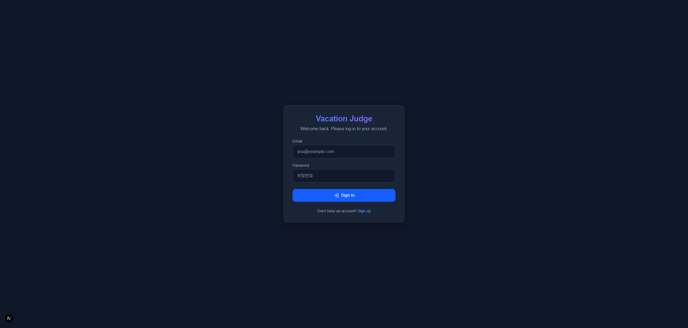
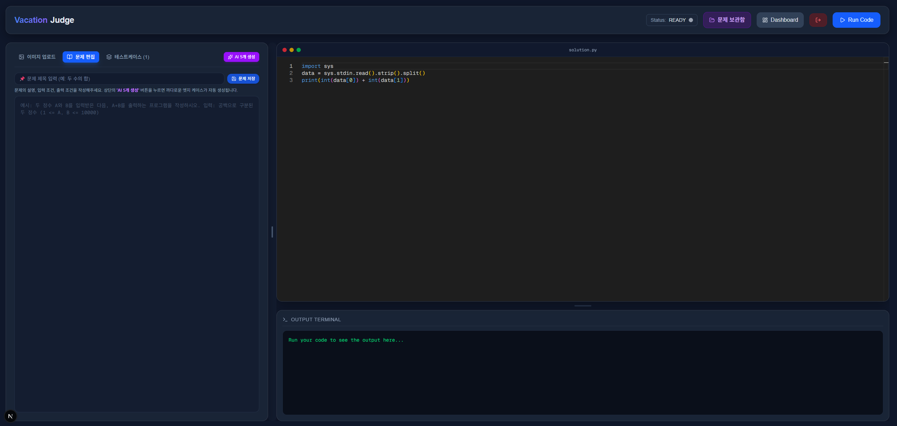
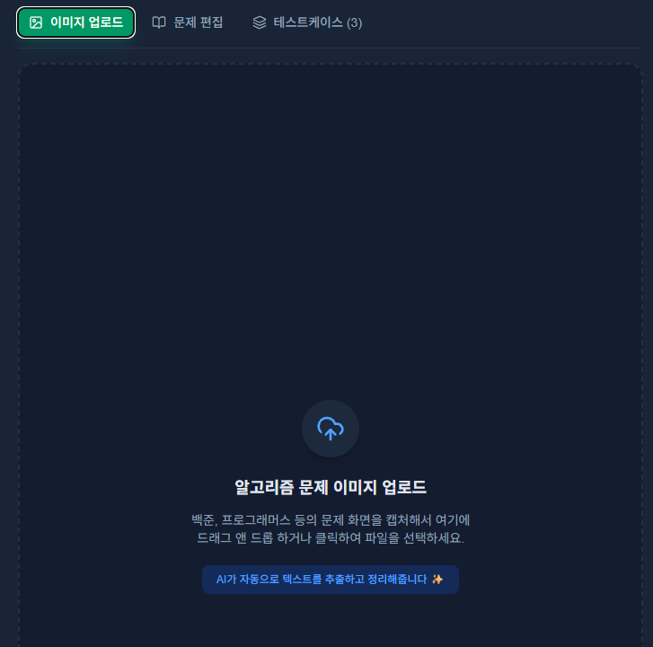
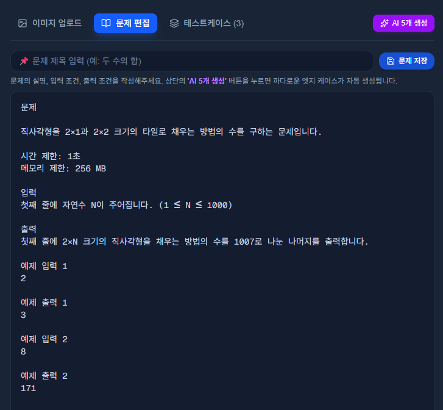
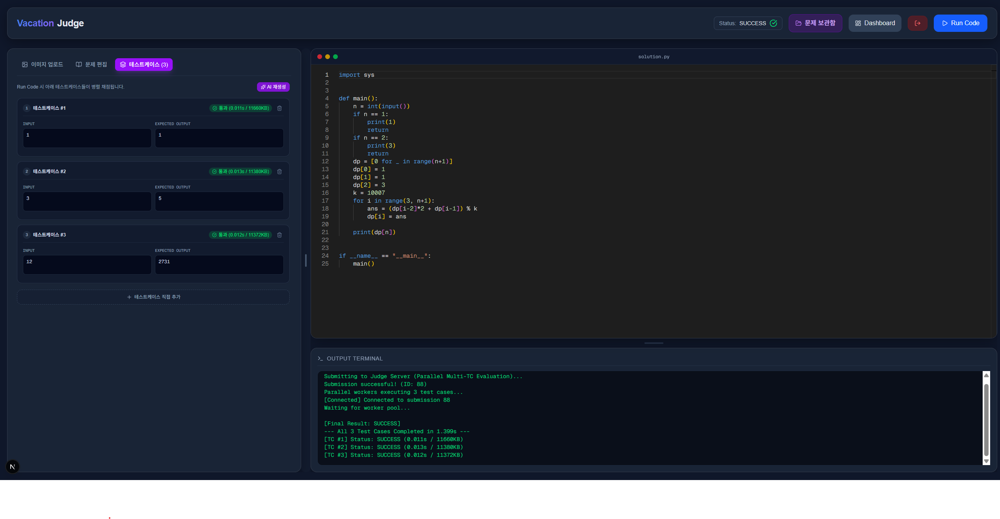
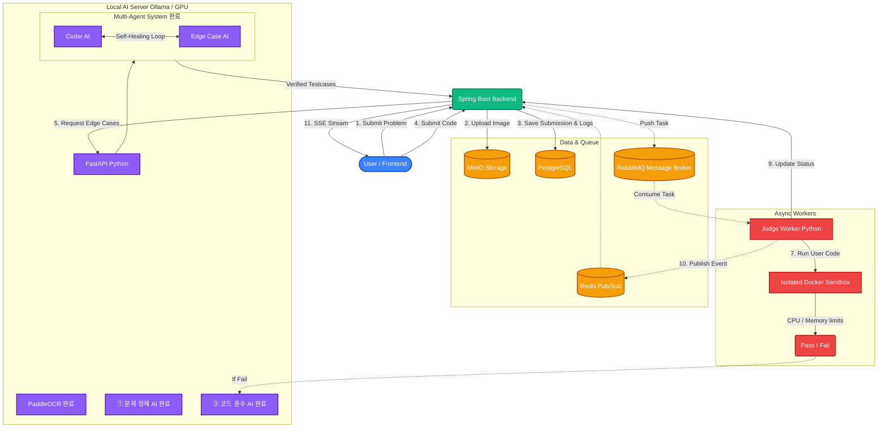
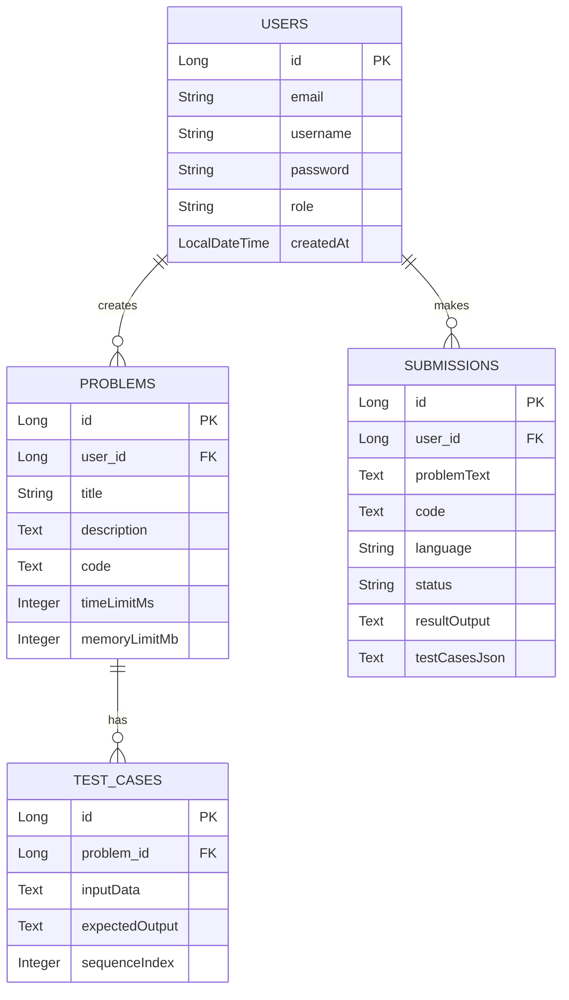

# 🚀 AI 기반 알고리즘 악질 저지(Judge) 및 1:1 코딩 마스터 플랫폼

<div align="center">
  <h3>"Multi-Agent 자가 치유(Self-Healing) 시스템을 통한 완벽한 반례 검증 및 3대 AI 플랫폼"</h3>
</div>

---

## 📖 1. 기획 배경 및 비전 (Background & Vision)
알고리즘 문제풀이 경험을 통해 기존 플랫폼들을 통한 학습의 한계를 느껴서 직접 만들게 되었습니다. 
기존 상용 AI는 코드를 잘 짜주지만, 유저가 제출한 코드의 '논리적 반례(Edge Case)'나 '경계값(Boundary)'을 찾아내는 데는 매우 취약합니다.

이를 해결하기 위해, 단순한 채점기를 넘어선 **All-in-One 코딩 마스터 AI 플랫폼**을 구축합니다.
- 사용자가 휘갈겨 쓴 메모나 이미지를 깔끔한 문제로 바꿔주고 (**문제 정제 AI**)
- 그 문제에 대한 악랄한 반례를 스스로 코드를 짜가며 완벽하게 생성/검증하고 (**Multi-Agent 엣지 케이스 AI**)
- 채점에 실패한 사용자에게 정답 코드와 비교하여 1:1 과외처럼 피드백을 주는 (**코드 훈수 AI**)

이 세 개의 특화된 AI가 유기적으로 맞물려 동작하는 시스템을 지향합니다.

---

## 🧠 2. 핵심 AI 기능 소개 (Core AI Features)

플랫폼을 구성하는 3대 AI 엔진이 모두 구현되어 유기적으로 동작합니다.

### ① 문제 정제 AI (Problem Refiner)
- 대충 적은 메모나 캡처된 문제 이미지를 **PaddleOCR**을 통해 텍스트로 자동 추출합니다.
- 추출된 텍스트를 원본 이미지와 실시간으로 비교 및 수정할 수 있는 **하이브리드 Split-View UI**를 제공합니다.
- 거친 텍스트를 LLM을 거쳐 최종적으로 백준(BOJ) 스타일의 깔끔한 문제 포맷으로 정제합니다.

### ② Multi-Agent 자가 치유 엣지 케이스 시스템 (Self-Healing)
단순히 AI에게 반례를 만들어 달라고 요청하면 문법 에러나 논리적 오류가 발생합니다. 이를 방지하기 위해 **2개의 분리된 AI 에이전트**가 서로 피드백을 주고받으며 스스로 디버깅하는 아키텍처를 도입했습니다.
- 🤖 **Coder AI**: 문제를 풀기 위한 최적의 정답 파이썬 코드를 작성합니다.
- 😈 **Edge Case AI**: 문제를 틀리게 유도할 악질적인 엣지 케이스(입력값) 데이터를 생성합니다.
- 🔄 **Self-Healing Loop**: Coder AI의 코드가 엣지 케이스 처리 중 에러를 뿜으면, 에러 로그를 분석하여 스스로 코드를 디버깅하고 수정(자가 치유)합니다.

### ③ 코드 훈수 AI (Code Coach)
- 제출한 코드가 오답일 경우, 터미널에서 즉시 **'💡 AI 힌트 받기'** 버튼을 제공합니다.
- 사용자의 틀린 코드와 정답 코드를 Qwen 2.5 7B 모델이 1:1로 내부 비교 분석합니다.
- 정답을 스포일러하지 않고, 놓친 엣지 케이스나 논리적 결함만을 마크다운 형태로 짚어주는 완벽한 과외 선생님 역할을 수행합니다. (추후 수집된 실제 유저 오답 데이터로 파인튜닝 고도화 예정)

---

## 🖥️ 실제 구동 화면 (Screenshots)

### 1. 로그인 (Login)


### 2. 메인 페이지 (Main Dashboard)


### 3. 문제 이미지 업로드 (Image Upload)


### 4. OCR을 통한 텍스트 변환 (Problem Refinement)


### 5. AI 자동 코드 생성 및 엣지 케이스 검증 (Self-Healing)


---

## 🏗 3. 시스템 아키텍처 다이어그램 (System Architecture)



---

## 🗄️ 4. 데이터베이스 구조 (ERD)



---

## 🛠 5. 기술 스택 및 엔지니어링 챌린지

### 5.1. 기술 스택 (Tech Stack)
- **Frontend**: React, Next.js, TailwindCSS, Monaco Editor (웹 IDE, 정답/내 코드 분할 탭 지원)
- **Backend API**: Java 17, Spring Boot, Spring Data JPA, Spring WebFlux (SSE 통신), **Spring Security & JWT**
- **Message Broker / Cache**: RabbitMQ (채점 비동기 큐), Redis (SSE 브로드캐스팅)
- **Database / Storage**: PostgreSQL, MinIO (S3 호환)
- **Sandbox / DevOps**: Python Docker SDK, Docker Compose
- **AI Server**: FastAPI, Ollama (Qwen 2.5 7B)

### 5.2. 핵심 엔지니어링 주안점 (Engineering Highlights)
- **🤖 Multi-Agent 프롬프트 엔지니어링**: KISS(Keep It Simple, Stupid) 원칙과 엄격한 입력 포맷 강제(예: `input()` 절대 금지 및 `sys.stdin.read()` 강제)를 통해 소형(7B) 언어 모델의 '환각(Hallucination)' 및 입출력(I/O) 에러를 완벽 통제.
- **🛡️ 완벽한 샌드박스 보안**: 악의적인 코드 방어를 위해 커스텀 채점 워커가 `--network none`, `--cap-drop=ALL` 등 격리된 도커 환경에서만 유저 코드를 실행.
- **⚡ 이기종 언어 분산 처리**: Spring Boot(Java)의 웹 응답과 Python(Worker)의 샌드박스 연산을 `RabbitMQ`로 완벽히 분리.

---

## 📂 6. 프로젝트 폴더 구조
```text
.
├── docker-compose.yml        # 인프라(DB, 큐, Redis) 및 AI 서버(FastAPI) 오케스트레이션
├── docker-compose.prod.yml   # EC2 프로덕션 환경 전용 배포 오케스트레이션
├── frontend/                 # Next.js 프론트엔드 (Port 3000)
├── backend_api/              # Spring Boot 메인 웹 서버 (Port 8080)
├── judge_worker/             # 커스텀 샌드박스 채점 엔진 (RabbitMQ Worker)
├── ai_server/                # MAS 에이전트 루프 및 FastAPI 서버 (Port 8000)
└── dataset/                  # AI 모델 학습용 데이터 수집/생성 파이프라인
```

---

## 🚀 7. 로컬 실행 방법 (Local Development)

### 사전 요구 사항
- **Docker Desktop** (WSL2 기반 실행 권장)
- **Node.js** (v18 이상), **Java 17**, **Python 3.10 이상**
- [Ollama for Windows](https://ollama.com/) 설치

### 로컬 실행 단계
1. **환경 변수 설정**: 루트 폴더에 있는 `.env.example` 파일을 복사하여 `.env`를 생성하고, 데이터베이스 비밀번호 및 JWT 암호키를 설정합니다. (스프링 부트는 `application.yml`에서 이 루트 `.env` 파일을 자동으로 읽어오므로 코드에 비밀키가 하드코딩되지 않아 안전합니다.)
2. **인프라 및 AI 서버 구동**: `docker-compose up -d --build` (PostgreSQL, Redis, RabbitMQ, FastAPI 띄우기)
3. **로컬 AI 모델 로드**: 터미널에서 `ollama run qwen2.5:7b` (최초 1회 모델 다운로드 및 실행 필요)
4. **백엔드 구동**: `cd backend_api` 이동 후 `./gradlew bootRun`
5. **채점 워커 구동**: `cd judge_worker` 이동 후 `python worker.py`
6. **프론트엔드 구동**: `cd frontend` 이동 후 `npm run dev` (`http://localhost:3000` 접속)

---

## 🌍 8. 프로덕션 배포 가이드 (Deployment)

현재 시스템은 안정적인 서비스 제공을 위해 프론트엔드와 백엔드를 물리적으로 분리하여 배포하고 있습니다.

### 💻 Frontend (Vercel)
- Vercel과 GitHub Repository 연동을 통해 CI/CD 파이프라인이 구축되어 있습니다.
- 환경 변수(`NEXT_PUBLIC_API_URL`, `NEXT_PUBLIC_AI_API_URL`)를 백엔드 EC2 인스턴스의 탄력적 IP(EIP) 주소로 매핑해야 합니다.
- **배포 명령어**: `main` 브랜치에 코드가 푸시되면 Vercel이 자동으로 빌드 및 무중단 배포를 수행합니다.

### ☁️ Backend & AI Server (AWS EC2)
- AWS EC2(Ubuntu) 인스턴스 위에서 백엔드 및 인프라 서버가 구동됩니다.
- **Docker 기반 무중단 환경**: 
  - `docker-compose.prod.yml`을 사용하여 Spring Boot(웹), FastAPI(AI), Worker(채점), DB, Message Queue를 일괄 관리합니다.
- **배포 절차**:
  1. EC2 서버 접속 후 최신 소스코드 `git pull`
  2. 최신 코드 기반 빌드 및 재시작: `docker-compose -f docker-compose.prod.yml up -d --build`
  3. 방화벽(AWS Security Group)에서 `8080`(Spring Boot) 및 `8000`(FastAPI) 포트가 Vercel 쪽에서 접근할 수 있도록 열려있는지 확인.
