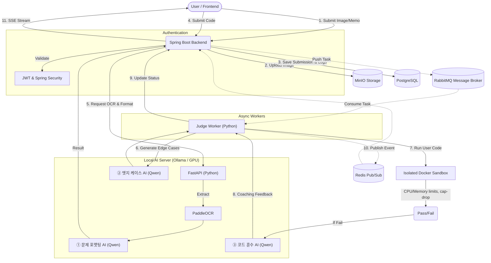

# 🚀 AI 기반 알고리즘 악질 저지(Judge) 및 1:1 코딩 마스터 플랫폼

<div align="center">
  <h3>"문제 포맷팅부터 엣지 케이스 생성, 그리고 1:1 코드 훈수까지 담당하는 트리플(Triple) AI 플랫폼"</h3>
</div>

---

## 📖 1. 기획 배경 및 비전 확장 (Background & Vision)
알고리즘 문제풀이 경험을 통해 기존 플랫폼들을 통한 학습의 한계를 느껴서 직접 만들게 되었습니다. 
기존 상용 AI는 코드를 잘 짜주지만, 유저가 제출한 코드의 '논리적 반례(Edge Case)'나 '경계값(Boundary)'을 찾아내는 데는 매우 취약합니다.

이를 해결하기 위해, 단순한 채점기를 넘어선 **All-in-One 코딩 마스터 AI 플랫폼**을 구축합니다.
- 사용자가 휘갈겨 쓴 메모나 이미지를 깔끔한 문제로 바꿔주고 (**문제 포맷팅 AI**)
- 그 문제에 대한 악랄한 반례를 생성하여 완벽하게 채점하고 (**엣지 케이스 생성 AI**)
- 채점에 실패한 사용자에게 정답 코드와 비교하여 1:1 과외처럼 피드백을 주는 (**코드 훈수 AI**)
세 개의 특화된 AI가 유기적으로 맞물려 동작하는 시스템을 지향합니다.

---

## 🧠 2. 3대 핵심 AI 모델 (Core Triple AI)

| AI 모델 | 역할 및 기능 | 학습 데이터 추출 방식 |
| :--- | :--- | :--- |
| **① 문제 포맷팅 AI (Problem Formulator)** | 대충 적은 메모나 정돈되지 않은 OCR 텍스트를 백준(BOJ) 스타일의 깔끔한 문제 형식으로 변환 | 깨끗한 한국어 문제 텍스트에 고의로 오타나 노이즈를 섞은 데이터 쌍으로 파인튜닝 |
| **② 엣지 케이스 생성 AI (Edge Case Generator)** | 문제와 정답 코드를 바탕으로 최대치, 경계값 등을 찌르는 치명적인 엣지 케이스(반례) 자동 생성 | DeepMind `CodeContests` 기반의 자체 샌드박스 검증을 거친 **5,500여 개의 고품질 ShareGPT 데이터셋 구축 및 파인튜닝 완료** |
| **③ 코드 훈수 AI (Code Coach)** | 사용자의 틀린 코드와 정답 코드를 1:1로 비교 분석하여, 논리적 결함과 해결책(예: 메모리 누수, 투 포인터) 피드백 제공 | DeepMind `CodeContests`의 실제 유저 `[틀린 코드 + 정답 코드 ➡️ 피드백]` 데이터로 파인튜닝 |

---

## 🏗 3. 시스템 아키텍처 다이어그램 (System Architecture)



---

## ✨ 4. 핵심 워크플로우 (Core Workflow)
1. **문제 스캔 및 포맷팅**: `PaddleOCR`이 추출한 난잡한 텍스트를 **문제 포맷팅 AI**가 정제된 알고리즘 문제로 변환 및 등록.
2. **반례 생성 (AI Inference)**: **엣지 케이스 AI**가 문제 조건을 분석하여 까다로운 엣지 케이스(반례) 데이터 생성.
3. **병렬 샌드박스 채점**: 커스텀 Python 워커(`worker.py`)가 Docker 컨테이너를 띄워 유저의 코드를 안전하게 채점.
4. **1:1 코드 리뷰 (AI Review)**: 채점 실패 시(`FAIL`), **코드 훈수 AI**가 정답 코드와 유저 코드를 비교 분석하여 정밀한 힌트를 제공.
5. **실시간 피드백 (SSE)**: 각 테스트 케이스별 채점 진행 상황을 프론트엔드로 `Server-Sent Events (SSE)`를 통해 실시간 브로드캐스팅.
6. **(예정) 사용자 대시보드**: JWT 기반 로그인 후, 사용자별 제출 기록, 정답률, AI 힌트 열람 로그 등을 시각화.

---

## 🛠 5. 기술 스택 및 엔지니어링 챌린지

### 5.1. 기술 스택 (Tech Stack)
- **Frontend**: React, Next.js, TailwindCSS, Monaco Editor (웹 IDE)
- **Backend API**: Java 17, Spring Boot, Spring Data JPA, Spring WebFlux (SSE 통신), **Spring Security & JWT**
- **Message Broker / Cache**: RabbitMQ (채점 비동기 큐), Redis (SSE 브로드캐스팅)
- **Database / Storage**: PostgreSQL, MinIO (S3 호환)
- **Sandbox / DevOps**: Python Docker SDK, Docker Compose, Nginx & Cloudflare (호스팅/프록시 예정)
- **AI Server**: FastAPI, PaddleOCR, Ollama (Qwen 2.5 7B 파인튜닝 모델들)

### 5.2. 핵심 엔지니어링 주안점 (Engineering Highlights)
- **🛡️ 완벽한 샌드박스 보안**: 악의적인 코드(Fork Bomb 등) 방어를 위해 `--network none`, `--memory 256m`, `--pids-limit 64`, `--cap-drop=ALL` 적용.
- **⚡ 이기종 언어(Polyglot) 간 비동기 분산 처리**: Spring Boot(Java)의 웹 응답과 Python(Worker)의 연산을 `RabbitMQ`로 완벽히 분리하여 병목 방지.
- **🤖 다중 AI 마이크로서비스**: 충돌을 피해 `FastAPI` + `PaddleOCR` + `Ollama` 3대 AI 엔진을 리눅스 도커 컨테이너로 완벽히 격리.

---

## 🗄️ 6. 데이터베이스 구조 (ERD 요약)
- **Users / RefreshTokens**: 유저 인증 정보 및 JWT 리프레시 토큰
- **Problems**: 알고리즘 문제 메타데이터
- **Submissions / UserLogs**: 제출 코드, 결과 로그 및 활동 내역
- **TestCases**: `엣지 케이스 AI`가 생성한 문제별 반례 데이터
- **AiReviews**: `코드 훈수 AI`가 작성한 1:1 피드백 JSON

---

## 🗺️ 7. 향후 로드맵 및 프로덕션 호스팅 (Future Roadmap & Hosting)
1. **보안 및 인증**: 상태 비저장(Stateless) 아키텍처 및 JWT Access/Refresh Token 도입.
2. **사용자 경험**: 마이페이지 & 오답 노트, AI 힌트 기록 대시보드 개발.
3. **프로덕션 호스팅**: 
   - **CI/CD**: GitHub Actions를 통한 `docker-compose.prod.yml` 기반의 자동 배포 파이프라인(CD) 구축 완료.
   - **Web/DB**: AWS EC2에 백엔드/워커/메시지큐 인프라 완벽 구성.
   - **AI Server**: 로컬 물리 GPU(RTX 4070 Super)를 ngrok/Cloudflare Tunnels로 터널링하여 비용 0원의 자체 AI 인프라 구축.

---

## 📂 8. 프로젝트 폴더 구조
```text
.
├── docker-compose.yml        # 인프라(DB, 큐, Redis) 및 AI 서버(FastAPI) 오케스트레이션
├── docker-compose.prod.yml   # EC2 프로덕션 환경 전용 배포 오케스트레이션
├── frontend/                 # Next.js 프론트엔드 (Port 3000)
├── backend_api/              # Spring Boot 메인 웹 서버 (Port 8080)
├── judge_worker/             # 커스텀 샌드박스 채점 엔진 (RabbitMQ Worker)
├── ai_server/                # PaddleOCR 및 Ollama 연동 FastAPI 서버 (Port 8000)
└── dataset/                  # AI 모델 학습용 엣지 케이스 데이터 수집/생성/검증 파이프라인
```

---

## 🚀 9. 실행 방법 (Getting Started)

본 프로젝트는 Windows 환경(GPU 권장)을 기준으로 작성되었습니다.

### 사전 요구 사항
- **Docker Desktop** (WSL2 기반 실행 권장)
- **Node.js** (v18 이상), **Java 17**, **Python 3.10 이상**
- [Ollama for Windows](https://ollama.com/) 설치

### 실행 단계
1. **인프라 및 AI 서버 구동**: `docker-compose up -d --build`
2. **로컬 AI 모델 로드**: 터미널에서 `ollama run qwen2.5:7b`
3. **백엔드 구동**: `cd backend_api` 후 `./gradlew bootRun`
4. **채점 워커 구동**: `cd judge_worker` 후 `python worker.py`
5. **프론트엔드 구동**: `cd frontend` 후 `npm run dev` (`http://localhost:3000` 접속)
